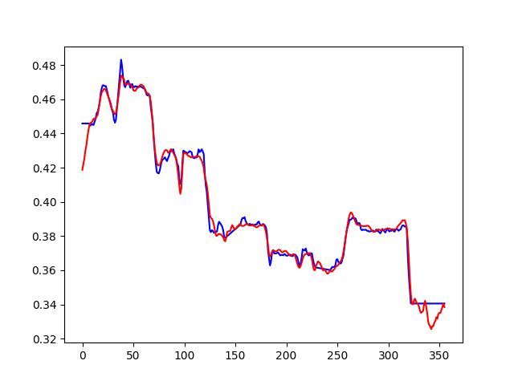

# FCPE(原MelPE)
~纯粹实验性的从mel到f0的f0提取器，性能可能很玩具，如果成功将会被用于[Diffusion-SVC](https://github.com/CNChTu/Diffusion-SVC), 兴许[so-vits-svc](https://github.com/svc-develop-team/so-vits-svc)也会用。新图例已更新。~

性能不玩具！[Diffusion-SVC](https://github.com/CNChTu/Diffusion-SVC)已经实装。~[so-vits-svc](https://github.com/svc-develop-team/so-vits-svc)马上就来。
[so-vits-svc](https://github.com/svc-develop-team/so-vits-svc)Latest 版本堂堂公测！。~ [so-vits-svc](https://github.com/svc-develop-team/so-vits-svc)已正式投入使用

# 网络结构图

